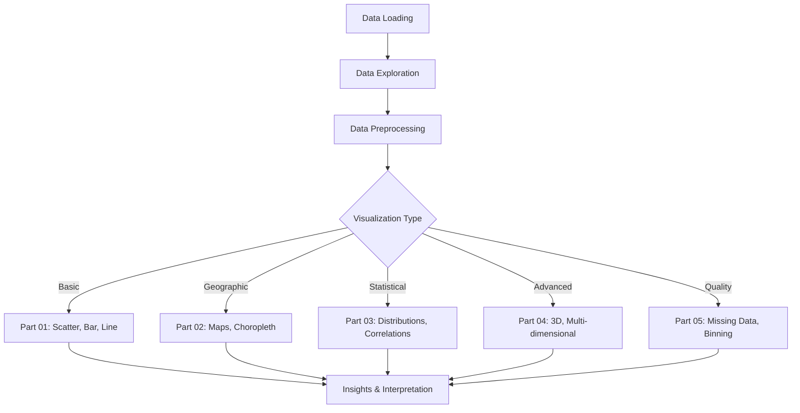
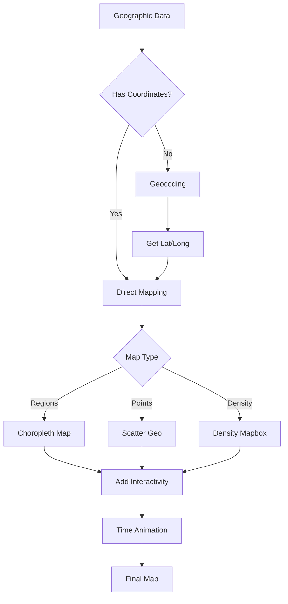
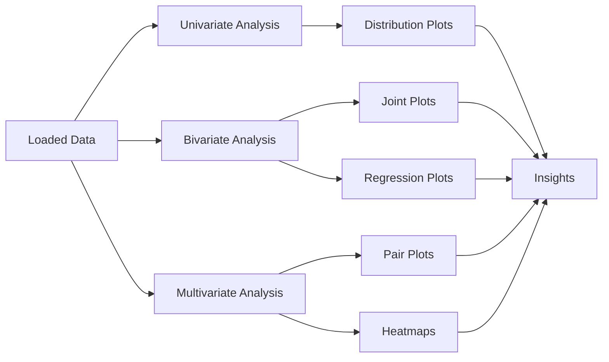
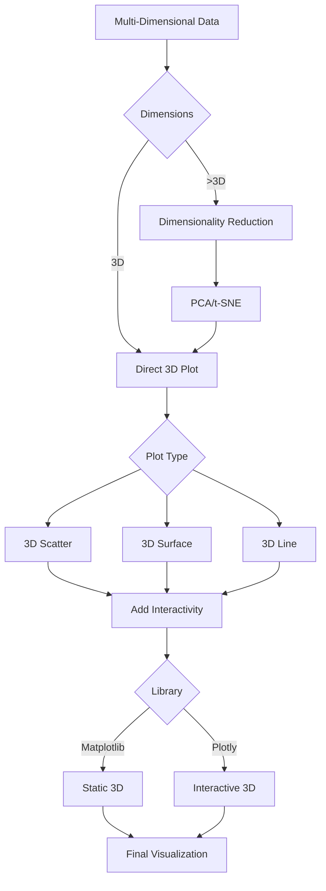
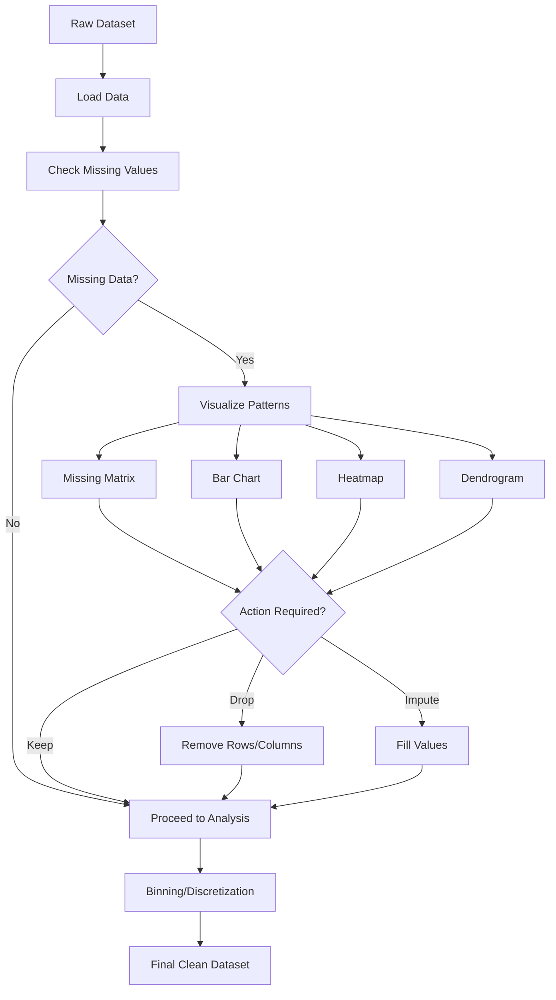
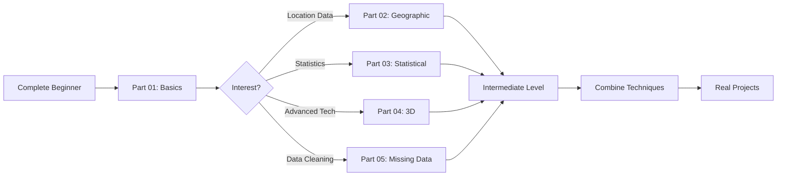

# 📊 Comprehensive Guide to Enhanced Visualization Notebooks

## 📑 Table of Contents

1. [Overview](#overview)
2. [Part 01: Basic Visualizations](#part-01-basic-visualizations)
3. [Part 02: Geographic Visualizations](#part-02-geographic-visualizations)
4. [Part 03: Statistical Visualizations](#part-03-statistical-visualizations)
5. [Part 04: 3D Visualizations](#part-04-3d-visualizations)
6. [Part 05: Missing Data Visualization](#part-05-missing-data-visualization)
7. [Comparison Table](#comparison-table)
8. [Best Practices](#best-practices)
9. [Quick Reference](#quick-reference)

---

## Overview

This documentation provides a comprehensive guide to five enhanced Jupyter notebooks designed for machine learning and data science visualization. Each notebook progressively builds upon visualization concepts, from basic plots to advanced 3D visualizations and data quality assessment.

### 🎯 Purpose

These notebooks serve as:
- **Educational Resource**: Step-by-step tutorials for beginners
- **Reference Guide**: Quick lookup for visualization techniques
- **Best Practices**: Production-ready code examples
- **Portfolio Projects**: Demonstrable data science skills

### 📦 Prerequisites

| Requirement | Version | Purpose |
|------------|---------|---------|
| Python | 3.7+ | Core language |
| Pandas | 1.0+ | Data manipulation |
| NumPy | 1.18+ | Numerical operations |
| Matplotlib | 3.1+ | Static visualizations |
| Seaborn | 0.10+ | Statistical plots |
| Plotly | 4.0+ | Interactive visualizations |

### 🔄 Workflow Overview



---

## Part 01: Basic Visualizations

### 📘 Overview

**File**: `machine-learning-visualization-part-1.ipynb`

**File on Kaggle**: [Kaggle link](https://www.kaggle.com/code/mayuringle8890/machine-learning-visualization-part-1/)
**File on Github**: [Github link](https://github.com/thecoder8890/ml-visual-handbook/blob/main/machine-learning-visualization-part-1.ipynb)

**Focus**: Fundamental visualization techniques using Matplotlib, Seaborn, and Plotly.

**Code Cells**: 80 | **Markdown Cells**: 18

### 🎯 Learning Objectives

1. Load and explore datasets
2. Create basic scatter plots
3. Build bar charts and categorical visualizations
4. Understand marginal distributions
5. Master plot customization

### 📊 Visualization Flow


### 🔑 Key Features

| Feature | Description | Library | Complexity |
|---------|-------------|---------|------------|
| **Scatter Plots** | Relationship between 2 variables | Matplotlib/Plotly | ⭐ Basic |
| **Bar Charts** | Categorical comparisons | Matplotlib/Seaborn | ⭐ Basic |
| **Line Plots** | Trends over time/sequence | Matplotlib | ⭐ Basic |
| **Histograms** | Distribution visualization | Seaborn | ⭐⭐ Intermediate |
| **Box Plots** | Statistical summaries | Seaborn | ⭐⭐ Intermediate |
| **Marginal Plots** | Combined distributions | Plotly | ⭐⭐⭐ Advanced |

### 📋 Key Sections

#### Section 1: Data Loading

```python
# Standard data loading pattern
import pandas as pd
import numpy as np

# Load dataset
df = pd.read_csv('dataset.csv')

# Initial exploration
df.head()
df.info()
df.describe()
```

**Purpose**: Understand data structure, types, and basic statistics.

#### Section 2: Scatter Plots

**Techniques Covered**:
- Basic scatter plot
- Colored by category
- Sized by variable
- With trend lines
- Interactive with Plotly

**When to Use**: 
- Exploring relationships between two continuous variables
- Identifying correlations
- Detecting outliers

#### Section 3: Bar Charts

**Variations**:
- Vertical/horizontal bars
- Grouped bars
- Stacked bars
- Percentage bars

**Best For**:
- Comparing categories
- Showing rankings
- Displaying distributions across groups

#### Section 4: Marginal Distributions

**Combines**:
- Central scatter plot
- Marginal histograms/box plots on axes
- Statistical overlays

**Value**: Shows both individual variable distributions AND their relationship.

### 🎨 Customization Techniques

| Aspect | Options | Code Example |
|--------|---------|--------------|
| **Colors** | Named, hex, RGB, colormaps | `color='red'`, `cmap='viridis'` |
| **Markers** | Shapes and sizes | `marker='o'`, `s=100` |
| **Labels** | Titles, axes, legends | `plt.title()`, `plt.xlabel()` |
| **Style** | Themes and presets | `sns.set_style('darkgrid')` |
| **Layout** | Subplots, grids | `plt.subplot(2,2,1)` |

### 💡 Best Practices (Part 01)

1. **Always explore data first**: Use `.info()`, `.describe()`, `.head()`
2. **Handle missing values**: Before visualizing
3. **Choose appropriate plot types**: Match visualization to data type
4. **Label everything**: Axes, titles, legends
5. **Use color purposefully**: Not just for aesthetics
6. **Consider accessibility**: Color-blind friendly palettes

### 📈 Sample Code Pattern

```python
import matplotlib.pyplot as plt
import seaborn as sns

# Set style
sns.set_style('whitegrid')
plt.figure(figsize=(10, 6))

# Create visualization
sns.scatterplot(data=df, x='feature1', y='feature2', 
                hue='category', size='value', alpha=0.6)

# Customize
plt.title('Feature Relationship Analysis', fontsize=16)
plt.xlabel('Feature 1', fontsize=12)
plt.ylabel('Feature 2', fontsize=12)
plt.legend(title='Category', bbox_to_anchor=(1.05, 1))

# Display
plt.tight_layout()
plt.show()
```

---

## Part 02: Geographic Visualizations

### 📘 Overview

**File**: `machine-learning-visualization-part-2.ipynb`


**File on Kaggle**: [Kaggle link](https://www.kaggle.com/code/mayuringle8890/machine-learning-visualization-part-2/)
**File on Github**: [Github link](https://github.com/thecoder8890/ml-visual-handbook/blob/main/machine-learning-visualization-part-2.ipynb)

**Focus**: Interactive geographic visualizations using Plotly and mapping techniques.

**Code Cells**: 12 | **Markdown Cells**: 18

### 🎯 Learning Objectives

1. Create choropleth maps
2. Master Plotly Express for interactive plots
3. Perform geocoding (location → coordinates)
4. Build animated time-series maps
5. Visualize spatial distributions

### 🗺️ Visualization Workflow



### 🔑 Key Features

| Visualization | Purpose | Interactivity | Best Use Case |
|--------------|---------|---------------|---------------|
| **Choropleth Map** | Color-coded regions | Hover, zoom, pan | Country/state comparisons |
| **Scatter Geo** | Points on map | Click, hover | City locations, events |
| **Density Map** | Heat mapping | Zoom, filter | Population density, hotspots |
| **Animated Map** | Time-series | Play/pause, slider | Data evolution over time |
| **Line Map** | Routes/connections | Hover paths | Migration, trade routes |

### 📋 Key Sections

#### Section 1: Environment Setup

**Libraries**:
- `plotly.express`: High-level interactive plots
- `plotly.graph_objects`: Low-level customization
- `geocoder`: Location to coordinates conversion

#### Section 2: Data Exploration

**Dataset**: Heart Disease Dataset (with geographic augmentation)

**Key Operations**:
```python
# Load data
df = pd.read_csv('heart.csv')

# Check structure
print(df.shape)
df.head()
```

#### Section 3: Gapminder Dataset

**What is Gapminder?**
- Historical statistics (GDP, life expectancy, population)
- Multiple countries and years
- Perfect for animated visualizations

**Loading**:
```python
gapminder = px.data.gapminder()
```

#### Section 4: Geocoding

**Purpose**: Convert location names to latitude/longitude

**Example**:
```python
import geocoder

# Get coordinates for a location
g = geocoder.osm('New York City')
lat, lng = g.latlng
```

**Use Cases**:
- Customer locations
- Store addresses
- Event venues

#### Section 5: Choropleth Maps

**Code Pattern**:
```python
import plotly.express as px

fig = px.choropleth(
    df,
    locations='country_code',  # ISO country codes
    color='value',              # Color by this column
    hover_name='country',       # Show on hover
    color_continuous_scale='Viridis',
    title='World Data Visualization'
)

fig.show()
```

**Key Parameters**:
| Parameter | Description | Example Values |
|-----------|-------------|----------------|
| `locations` | Geographic identifiers | ISO codes, state names |
| `locationmode` | Type of location | 'ISO-3', 'USA-states' |
| `color` | Data for coloring | Any numeric column |
| `scope` | Map region | 'world', 'usa', 'europe' |
| `projection` | Map projection | 'natural earth', 'orthographic' |

#### Section 6: Animated Visualizations

**Creating Time-Series Animations**:
```python
fig = px.choropleth(
    gapminder,
    locations='iso_alpha',
    color='lifeExp',
    hover_name='country',
    animation_frame='year',  # Animate by year
    animation_group='country',
    color_continuous_scale='Plasma',
    title='Life Expectancy Over Time'
)

fig.show()
```

**Controls**:
- Play/Pause button
- Year slider
- Speed adjustment

### 🎨 Customization Options

```python
fig.update_layout(
    geo=dict(
        showframe=False,
        showcoastlines=True,
        projection_type='natural earth'
    ),
    title=dict(
        text='Custom Title',
        x=0.5,
        font=dict(size=20, color='darkblue')
    )
)
```

### 💡 Best Practices (Part 02)

1. **Use appropriate projections**: Natural Earth for world, Albers for USA
2. **Choose color scales wisely**: Sequential for continuous, categorical for discrete
3. **Include hover information**: Make maps informative
4. **Test geocoding results**: Verify coordinates before plotting
5. **Optimize for performance**: Limit data points for smooth interaction
6. **Consider map context**: Show coastlines, borders as needed

### 🚀 Advanced Techniques

**Multi-Layer Maps**:
```python
# Combine choropleth with scatter points
fig = go.Figure()

# Add choropleth layer
fig.add_trace(go.Choropleth(...))

# Add scatter points
fig.add_trace(go.Scattergeo(...))

fig.show()
```

---

## Part 03: Statistical Visualizations

### 📘 Overview

**File**: `machine-learning-visualization-part-3.ipynb`


**File on Kaggle**: [Kaggle link](https://www.kaggle.com/code/mayuringle8890/machine-learning-visualization-part-3/)
**File on Github**: [Github link](https://github.com/thecoder8890/ml-visual-handbook/blob/main/machine-learning-visualization-part-3.ipynb)

**Focus**: Statistical analysis through visualization using Seaborn.

**Code Cells**: 5 | **Markdown Cells**: 6

### 🎯 Learning Objectives

1. Create and interpret joint plots
2. Visualize distributions effectively
3. Compare distributions across categories
4. Build correlation heatmaps
5. Use pair plots for multi-variable analysis

### 📊 Statistical Visualization Pipeline



### 🔑 Key Features

| Plot Type | Purpose | Shows | Seaborn Function |
|-----------|---------|-------|------------------|
| **Joint Plot** | Bivariate + distributions | 2 variables + margins | `sns.jointplot()` |
| **Distribution Plot** | Data spread | Histogram + KDE | `sns.displot()` |
| **Box Plot** | Statistical summary | Quartiles, outliers | `sns.boxplot()` |
| **Violin Plot** | Distribution shape | Density + quartiles | `sns.violinplot()` |
| **Heatmap** | Matrix visualization | Correlations, patterns | `sns.heatmap()` |
| **Pair Plot** | Multiple relationships | All variable pairs | `sns.pairplot()` |

### 📋 Key Sections

#### Section 1: Environment Setup

**Core Libraries**:
```python
import seaborn as sns
import matplotlib.pyplot as plt
import pandas as pd
import numpy as np
from scipy import stats
```

**Configuration**:
```python
# Set style for better aesthetics
sns.set_style('whitegrid')
plt.rcParams['figure.figsize'] = (12, 8)
```

#### Section 2: Data Loading

**Dataset**: Heart Disease Dataset

**Initial Exploration**:
- Shape and structure
- Data types
- Missing values
- Basic statistics

#### Section 3: Joint Plots

**What is a Joint Plot?**

A joint plot combines:
- **Central plot**: Scatter, hexbin, or KDE of two variables
- **Marginal plots**: Distribution of each variable on the axes

**Types**:

| Kind | Central Plot | Use Case |
|------|--------------|----------|
| `scatter` | Scatter plot | Individual data points |
| `reg` | Scatter + regression | Linear relationships |
| `hex` | Hexbin density | Large datasets |
| `kde` | 2D density | Smooth distributions |
| `hist` | 2D histogram | Binned counts |

**Code Example**:
```python
# Basic joint plot
sns.jointplot(data=df, x='age', y='chol', kind='scatter')

# With regression
sns.jointplot(data=df, x='age', y='chol', kind='reg',
              color='steelblue', height=8)

# KDE joint plot
sns.jointplot(data=df, x='age', y='chol', kind='kde',
              fill=True, cmap='Blues')
```

#### Section 4: Regression Analysis

**Understanding Regression Lines**:
- Shows linear trend
- Confidence interval (shaded area)
- Pearson correlation coefficient

**Interpretation**:
```python
# Calculate correlation
from scipy.stats import pearsonr

corr, p_value = pearsonr(df['age'], df['chol'])
print(f'Correlation: {corr:.3f}, P-value: {p_value:.4f}')
```

**Statistical Significance**:
- p < 0.05: Significant relationship
- p ≥ 0.05: No significant relationship

#### Section 5: Distribution Plots

**Visualizing Single Variables**:
```python
# Histogram with KDE
sns.histplot(data=df, x='age', kde=True, bins=30)

# Distribution plot with hue
sns.displot(data=df, x='age', hue='target', 
            kind='kde', fill=True, alpha=0.5)
```

**Options**:
- `kde=True`: Add kernel density estimate
- `hue`: Separate by category
- `bins`: Number of histogram bins
- `fill`: Fill KDE area

#### Section 6: Box & Violin Plots

**Box Plot Structure**:
```
    Max (or Q3 + 1.5*IQR)
    ─────┐
         │
    Q3 ──┤
         │  ← IQR (Interquartile Range)
    Q2 ──┤  ← Median
         │
    Q1 ──┤
         │
    ─────┘
    Min (or Q1 - 1.5*IQR)
    
    •    ← Outliers
```

**Code Examples**:
```python
# Box plot
sns.boxplot(data=df, x='target', y='age')

# Violin plot (shows distribution shape)
sns.violinplot(data=df, x='target', y='age', 
               split=True, inner='quartile')

# Grouped comparison
sns.boxplot(data=df, x='cp', y='chol', hue='target')
```

#### Section 7: Correlation Heatmaps

**Purpose**: Visualize relationships between all numeric variables

**Code Pattern**:
```python
# Calculate correlation matrix
corr_matrix = df.corr()

# Create heatmap
plt.figure(figsize=(12, 10))
sns.heatmap(corr_matrix, 
            annot=True,          # Show values
            fmt='.2f',           # Format to 2 decimals
            cmap='coolwarm',     # Color scheme
            center=0,            # Center colormap at 0
            square=True,         # Square cells
            linewidths=1,        # Grid lines
            cbar_kws={'label': 'Correlation'})

plt.title('Feature Correlation Matrix')
plt.tight_layout()
plt.show()
```

**Interpreting Correlations**:
| Value Range | Interpretation |
|-------------|----------------|
| 0.9 to 1.0 | Very strong positive |
| 0.7 to 0.9 | Strong positive |
| 0.5 to 0.7 | Moderate positive |
| 0.3 to 0.5 | Weak positive |
| -0.3 to 0.3 | Negligible |
| -0.5 to -0.3 | Weak negative |
| -0.7 to -0.5 | Moderate negative |
| -0.9 to -0.7 | Strong negative |
| -1.0 to -0.9 | Very strong negative |

#### Section 8: Pair Plots

**Multi-Variable Exploration**:
```python
# Basic pair plot
sns.pairplot(df)

# With categorical coloring
sns.pairplot(df, hue='target', palette='Set2',
             diag_kind='kde',      # Diagonal plots
             plot_kws={'alpha': 0.6})
```

**What It Shows**:
- Diagonal: Distribution of each variable
- Off-diagonal: Scatter plots between variable pairs
- Colored by category (with `hue`)

**When to Use**:
- Initial data exploration
- Feature selection
- Identifying patterns across multiple variables

### 💡 Best Practices (Part 03)

1. **Check assumptions**: Linearity, normality for appropriate tests
2. **Handle outliers**: Identify and treat before statistical analysis
3. **Choose appropriate plots**: Match plot to data distribution
4. **Report statistics**: Include correlation coefficients, p-values
5. **Use appropriate color scales**: Diverging for correlations
6. **Consider sample size**: Some plots need sufficient data points

### 📊 Statistical Interpretation Guide

**P-Value Interpretation**:
- p < 0.001: ***Very significant***
- p < 0.01: **Significant**
- p < 0.05: *Significant*
- p ≥ 0.05: Not significant

**Effect Size**:
- Small: |r| < 0.3
- Medium: 0.3 ≤ |r| < 0.5
- Large: |r| ≥ 0.5

---

## Part 04: 3D Visualizations

### 📘 Overview

**File**: `machine-learning-visualization-part-4.ipynb`

**File on Kaggle**: [Kaggle link](https://www.kaggle.com/code/mayuringle8890/machine-learning-visualization-part-4/)
**File on Github**: [Github link](https://github.com/thecoder8890/ml-visual-handbook/blob/main/machine-learning-visualization-part-4.ipynb)

**Focus**: Three-dimensional and advanced multi-dimensional visualizations.

**Code Cells**: 6 | **Markdown Cells**: 8

### 🎯 Learning Objectives

1. Create 3D scatter and surface plots
2. Build interactive 3D visualizations with Plotly
3. Visualize multi-dimensional data
4. Use dimensionality reduction (PCA) for visualization
5. Create bubble charts (4D visualization)

### 📊 3D Visualization Pipeline



### 🔑 Key Features

| Visualization | Dimensions | Best For | Library |
|--------------|------------|----------|---------|
| **3D Scatter** | 3-4 (with color/size) | Point distributions | Matplotlib/Plotly |
| **3D Surface** | Z = f(X, Y) | Continuous functions | Matplotlib/Plotly |
| **3D Line** | Time-series in 3D | Trajectories, paths | Matplotlib |
| **Bubble Chart** | 4 (x, y, z, size) | Multi-dimensional relationships | Plotly |
| **PCA 3D** | N → 3 | High-dimensional data | Plotly + sklearn |

### 📋 Key Sections

#### Section 1: Environment Setup

**Core Libraries**:
```python
import numpy as np
import pandas as pd
import matplotlib.pyplot as plt
from mpl_toolkits.mplot3d import Axes3D
import plotly.express as px
import plotly.graph_objects as go
from sklearn.decomposition import PCA
from sklearn.preprocessing import StandardScaler
```

**3D Matplotlib Setup**:
```python
from mpl_toolkits.mplot3d import Axes3D

fig = plt.figure(figsize=(10, 8))
ax = fig.add_subplot(111, projection='3d')
```

#### Section 2: Data Loading

**Dataset**: Brain Stroke Dataset

**Features for 3D Visualization**:
- Age
- BMI (Body Mass Index)
- Average Glucose Level
- (Color/size for additional dimensions)

#### Section 3: Basic 3D Scatter Plot

**Matplotlib Example**:
```python
fig = plt.figure(figsize=(12, 9))
ax = fig.add_subplot(111, projection='3d')

# Create scatter plot
scatter = ax.scatter(df['age'], 
                     df['bmi'], 
                     df['avg_glucose_level'],
                     c=df['stroke'],          # Color by target
                     cmap='viridis',
                     s=50,                     # Point size
                     alpha=0.6,
                     edgecolors='k')

# Labels
ax.set_xlabel('Age', fontsize=12)
ax.set_ylabel('BMI', fontsize=12)
ax.set_zlabel('Glucose Level', fontsize=12)
ax.set_title('3D Patient Data Visualization', fontsize=14)

# Add colorbar
plt.colorbar(scatter, label='Stroke')
plt.show()
```

**Key Parameters**:
| Parameter | Description | Example |
|-----------|-------------|---------|
| `projection='3d'` | Enable 3D axes | Required for 3D |
| `c` | Color values | Numeric or categorical |
| `cmap` | Color map | 'viridis', 'plasma' |
| `s` | Point size | 50, or array |
| `alpha` | Transparency | 0.0 to 1.0 |

#### Section 4: Interactive 3D with Plotly

**Why Plotly?**
- Interactive rotation
- Zoom and pan
- Hover information
- Better for presentations

**Basic Plotly 3D**:
```python
fig = px.scatter_3d(df, 
                    x='age', 
                    y='bmi', 
                    z='avg_glucose_level',
                    color='stroke',
                    symbol='gender',
                    size='age',
                    hover_data=['work_type', 'smoking_status'],
                    title='Interactive 3D Patient Analysis',
                    labels={'age': 'Age (years)',
                            'bmi': 'Body Mass Index',
                            'avg_glucose_level': 'Glucose Level'})

fig.update_traces(marker=dict(line=dict(width=0.5, color='DarkSlateGrey')))
fig.show()
```

**Plotly Advantages**:
- ✅ Interactive controls
- ✅ Hover tooltips
- ✅ Export to HTML
- ✅ Better for web dashboards

#### Section 5: 3D Surface Plots

**Creating Meshgrid Data**:
```python
# Generate grid
x = np.linspace(-5, 5, 50)
y = np.linspace(-5, 5, 50)
X, Y = np.meshgrid(x, y)

# Define function
Z = np.sin(np.sqrt(X**2 + Y**2))
```

**Matplotlib Surface**:
```python
fig = plt.figure(figsize=(12, 9))
ax = fig.add_subplot(111, projection='3d')

surf = ax.plot_surface(X, Y, Z, 
                       cmap='coolwarm',
                       edgecolor='none',
                       alpha=0.8)

ax.set_xlabel('X')
ax.set_ylabel('Y')
ax.set_zlabel('Z')
plt.colorbar(surf)
plt.show()
```

**Plotly Surface**:
```python
fig = go.Figure(data=[go.Surface(x=X, y=Y, z=Z, 
                                 colorscale='Viridis')])

fig.update_layout(title='3D Surface Plot',
                  scene=dict(
                      xaxis_title='X Axis',
                      yaxis_title='Y Axis',
                      zaxis_title='Z Axis'),
                  width=900,
                  height=700)

fig.show()
```

#### Section 6: Dimensionality Reduction

**Why PCA for Visualization?**
- Reduce high-dimensional data to 3D
- Preserve maximum variance
- Visualize complex datasets

**PCA Workflow**:
```python
from sklearn.decomposition import PCA
from sklearn.preprocessing import StandardScaler

# Select numeric features
features = df.select_dtypes(include=[np.number]).columns
X = df[features]

# Standardize
scaler = StandardScaler()
X_scaled = scaler.fit_transform(X)

# Apply PCA
pca = PCA(n_components=3)
X_pca = pca.fit_transform(X_scaled)

# Create DataFrame
pca_df = pd.DataFrame(data=X_pca, 
                      columns=['PC1', 'PC2', 'PC3'])
pca_df['target'] = df['stroke'].values

# Visualize
fig = px.scatter_3d(pca_df, 
                    x='PC1', y='PC2', z='PC3',
                    color='target',
                    title='PCA 3D Visualization')
fig.show()
```

**Explained Variance**:
```python
print("Explained variance ratio:", pca.explained_variance_ratio_)
print("Total variance explained:", 
      sum(pca.explained_variance_ratio_))
```

#### Section 7: Bubble Charts (4D Visualization)

**Adding Fourth Dimension with Size**:
```python
fig = px.scatter_3d(df,
                    x='age',
                    y='bmi',
                    z='avg_glucose_level',
                    color='stroke',           # 4th dimension
                    size='heart_disease',     # 5th dimension!
                    hover_name='id',
                    title='5D Visualization (x, y, z, color, size)')

fig.show()
```

**Dimension Mapping**:
| Dimension | Visual Encoding | Best For |
|-----------|-----------------|----------|
| X-axis | Horizontal position | Primary variable |
| Y-axis | Vertical position | Secondary variable |
| Z-axis | Depth | Tertiary variable |
| Color | Hue | Categorical or continuous |
| Size | Point radius | Magnitude or importance |
| Shape | Marker type | Categories (limited) |

### 💡 Best Practices (Part 04)

1. **Limit data points**: Too many points obscure patterns
2. **Use appropriate projections**: Orthographic for technical, perspective for natural
3. **Add interactivity**: Rotation enhances understanding
4. **Choose colors carefully**: 3D depth perception affected by color
5. **Provide multiple views**: Show from different angles
6. **Consider accessibility**: Some users struggle with 3D perception
7. **Standardize data**: Before PCA or other dimensionality reduction
8. **Explain axes**: Especially for PCA (variance explained)

### 🎨 Customization Techniques

**Camera Position (Plotly)**:
```python
fig.update_layout(
    scene_camera=dict(
        eye=dict(x=1.5, y=1.5, z=1.5),
        center=dict(x=0, y=0, z=0),
        up=dict(x=0, y=0, z=1)
    )
)
```

**Viewing Angle (Matplotlib)**:
```python
ax.view_init(elev=30, azim=45)  # Elevation and azimuth
```

### 📊 When to Use 3D Visualizations

**Good Use Cases**:
- ✅ Truly 3-dimensional data (spatial, physical)
- ✅ Demonstrations and presentations (interactive)
- ✅ Exploratory analysis of multi-dimensional data
- ✅ Showing trajectories or time-series paths

**When to Avoid**:
- ❌ 2D alternatives are clearer
- ❌ Printed/static reports (hard to interpret)
- ❌ Precise value reading required
- ❌ Large datasets (performance issues)

---

## Part 05: Missing Data Visualization

### 📘 Overview

**File**: `machine-learning-visualization-part-5.ipynb`


**File on Kaggle**: [Kaggle link](https://www.kaggle.com/code/mayuringle8890/machine-learning-visualization-part-5/)
**File on Github**: [Github link](https://github.com/thecoder8890/ml-visual-handbook/blob/main/machine-learning-visualization-part-5.ipynb)

**Focus**: Visualizing and handling missing data, binning, and data preprocessing.

**Code Cells**: 7 | **Markdown Cells**: 8

### 🎯 Learning Objectives

1. Visualize missing data patterns
2. Assess data quality
3. Perform binning and discretization
4. Handle missing values appropriately
5. Create preprocessed datasets for modeling

### 📊 Missing Data Analysis Pipeline



### 🔑 Key Features

| Visualization | Purpose | Library | Insights Provided |
|--------------|---------|---------|-------------------|
| **Missing Matrix** | Overview of missingness | missingno | Patterns, extent |
| **Bar Chart** | Missing counts per column | missingno | Which features affected |
| **Heatmap** | Correlation of missingness | missingno | Related missing patterns |
| **Dendrogram** | Hierarchical clustering | missingno | Groups of missingness |

### 📋 Key Sections

#### Section 1: Environment Setup

**Core Libraries**:
```python
import pandas as pd
import numpy as np
import seaborn as sns
import matplotlib.pyplot as plt
import missingno as msno  # Specialized for missing data
```

**Installing missingno**:
```bash
pip install missingno
```

#### Section 2: Data Loading

**Dataset**: Heart Disease Dataset (with induced missing values for demonstration)

**Initial Check**:
```python
# Load data
df = pd.read_csv('heart.csv')

# Check for missing values
print("Missing values per column:")
print(df.isnull().sum())

# Percentage missing
print("\nPercentage missing:")
print((df.isnull().sum() / len(df)) * 100)
```

#### Section 3: Why Visualize Missing Data?

**Importance**:
1. **Pattern Detection**: Random vs. systematic missingness
2. **Impact Assessment**: How much data is affected
3. **Relationship Analysis**: Which variables have correlated missingness
4. **Decision Making**: Drop, impute, or keep as-is

**Types of Missingness**:
| Type | Description | Example | Handling |
|------|-------------|---------|----------|
| **MCAR** | Missing Completely At Random | Random survey non-response | Safe to drop |
| **MAR** | Missing At Random | Income missing for unemployed | Impute conditionally |
| **MNAR** | Missing Not At Random | High earners hide income | Complex imputation |

#### Section 4: Missing Data Visualizations

**Matrix Visualization**:
```python
# Missing data matrix
msno.matrix(df, figsize=(12, 6), fontsize=12)
plt.title('Missing Data Matrix')
plt.show()
```

**Interpretation**:
- White lines = missing values
- Black/colored = present values
- Patterns indicate systematic missingness

**Bar Chart**:
```python
# Missing data bar chart
msno.bar(df, figsize=(12, 6), fontsize=12, color='steelblue')
plt.title('Missing Data Count by Feature')
plt.show()
```

**Shows**:
- Absolute count of missing values
- Completeness bar (on right axis)

**Heatmap**:
```python
# Missing data correlation heatmap
msno.heatmap(df, figsize=(12, 10), fontsize=12)
plt.title('Missing Data Correlation')
plt.show()
```

**Interpretation**:
- Values close to 1: Missingness strongly correlated
- Values close to 0: Independent missingness
- Negative values: Inverse relationship

**Dendrogram**:
```python
# Hierarchical clustering of missingness
msno.dendrogram(df, figsize=(12, 6), fontsize=12)
plt.title('Missing Data Dendrogram')
plt.show()
```

**Use**: Identifies groups of features with similar missing patterns

#### Section 5: Handling Missing Data

**Strategies**:

| Method | When to Use | Pros | Cons |
|--------|-------------|------|------|
| **Drop Rows** | MCAR, <5% missing | Simple, no bias | Data loss |
| **Drop Columns** | >50% missing, not important | Clean dataset | Feature loss |
| **Mean/Median Imputation** | MCAR, numeric data | Simple, fast | Reduces variance |
| **Mode Imputation** | Categorical data | Preserves distribution | May increase mode frequency |
| **Forward/Backward Fill** | Time series | Maintains trends | Propagates errors |
| **Interpolation** | Ordered data | Smooth estimates | Assumes continuity |
| **Model-Based** | MAR, complex patterns | Sophisticated | Computationally expensive |

**Code Examples**:

```python
# Drop rows with any missing values
df_dropped = df.dropna()

# Drop columns with >50% missing
threshold = len(df) * 0.5
df_dropped_cols = df.dropna(axis=1, thresh=threshold)

# Mean imputation
df['age'].fillna(df['age'].mean(), inplace=True)

# Median imputation (more robust to outliers)
df['chol'].fillna(df['chol'].median(), inplace=True)

# Mode imputation for categorical
df['cp'].fillna(df['cp'].mode()[0], inplace=True)

# Forward fill (time series)
df.fillna(method='ffill', inplace=True)

# Interpolation
df['chol'].interpolate(method='linear', inplace=True)
```

**Advanced: Multiple Imputation**:
```python
from sklearn.impute import IterativeImputer

imputer = IterativeImputer(random_state=42)
df_imputed = pd.DataFrame(imputer.fit_transform(df), 
                          columns=df.columns)
```

#### Section 6: Binning and Discretization

**Purpose**: Convert continuous variables to categorical bins

**Why Bin Data?**
1. **Simplify models**: Reduce continuous complexity
2. **Handle outliers**: Group extreme values
3. **Create categories**: For business rules (e.g., age groups)
4. **Improve interpretability**: Easier to understand

**Equal-Width Binning**:
```python
# Create bins of equal width
df['age_bin'] = pd.cut(df['age'], 
                       bins=5,  # Number of bins
                       labels=['Very Young', 'Young', 'Middle', 
                               'Senior', 'Elderly'])

# Custom bin edges
df['chol_bin'] = pd.cut(df['chol'],
                        bins=[0, 200, 240, 300],
                        labels=['Low', 'Normal', 'High'])
```

**Equal-Frequency Binning (Quantiles)**:
```python
# Each bin has approximately same number of observations
df['age_qbin'] = pd.qcut(df['age'], 
                         q=4,  # Quartiles
                         labels=['Q1', 'Q2', 'Q3', 'Q4'])
```

**Visualizing Bins**:
```python
# Distribution of binned data
plt.figure(figsize=(12, 6))

plt.subplot(1, 2, 1)
df['age_bin'].value_counts().plot(kind='bar', color='skyblue')
plt.title('Age Distribution (Equal-Width Bins)')
plt.xlabel('Age Group')
plt.ylabel('Count')

plt.subplot(1, 2, 2)
df['age_qbin'].value_counts().plot(kind='bar', color='lightcoral')
plt.title('Age Distribution (Quantile Bins)')
plt.xlabel('Quartile')
plt.ylabel('Count')

plt.tight_layout()
plt.show()
```

#### Section 7: Advanced Joint Plots with Hue

**Multi-Dimensional Visualization**:
```python
# Joint plot with categorical hue
sns.jointplot(data=df, 
              x='age', 
              y='chol', 
              hue='target',
              kind='kde',
              fill=True,
              alpha=0.5,
              height=10)

plt.suptitle('Age vs. Cholesterol by Heart Disease Status', 
             y=1.02, fontsize=14)
plt.show()
```

**Benefits**:
- Shows distributions for each category
- Identifies class separation
- Useful for feature selection

### 💡 Best Practices (Part 05)

1. **Always visualize first**: Before handling missing data
2. **Document decisions**: Record why you dropped/imputed
3. **Check assumptions**: Ensure MCAR before simple imputation
4. **Test sensitivity**: See how imputation affects models
5. **Preserve original data**: Keep a copy before modifications
6. **Consider domain knowledge**: Subject matter experts guide imputation
7. **Bin carefully**: Too few bins lose information, too many overfit
8. **Choose appropriate bin strategy**: Equal-width vs. quantile based on use case

### 🔍 Data Quality Checklist

- [ ] Missing values identified and quantified
- [ ] Missingness patterns analyzed
- [ ] Appropriate handling strategy selected
- [ ] Imputation assumptions validated
- [ ] Outliers identified and addressed
- [ ] Binning applied where beneficial
- [ ] Data types correct
- [ ] Ranges validated (no impossible values)
- [ ] Duplicates checked
- [ ] Final dataset documented

---

## Comparison Table

### Feature Comparison Across All Notebooks

| Feature | Part 01 | Part 02 | Part 03 | Part 04 | Part 05 |
|---------|---------|---------|---------|---------|---------|
| **Primary Focus** | Basic plots | Geographic | Statistical | 3D/Multi-D | Data quality |
| **Code Cells** | 80 | 12 | 5 | 6 | 7 |
| **Markdown Cells** | 18 | 18 | 6 | 8 | 8 |
| **Difficulty** | ⭐ Beginner | ⭐⭐ Intermediate | ⭐⭐ Intermediate | ⭐⭐⭐ Advanced | ⭐⭐ Intermediate |
| **Interactivity** | Medium | High | Low | High | Medium |
| **Main Library** | Matplotlib | Plotly | Seaborn | Plotly/Matplotlib | missingno |
| **Dataset Used** | Various | Gapminder + Heart | Heart Disease | Brain Stroke | Heart Disease |
| **Key Technique** | Scatter/Bar | Choropleth maps | Joint plots | 3D scatter | Missing data viz |
| **Animation** | ❌ | ✅ | ❌ | ✅ | ❌ |
| **3D Support** | ❌ | ❌ | ❌ | ✅ | ❌ |
| **Statistical Tests** | ❌ | ❌ | ✅ | ❌ | ❌ |
| **Best For** | Learning basics | Location data | Correlations | Complex data | Preprocessing |

### Library Usage Matrix

| Library | Part 01 | Part 02 | Part 03 | Part 04 | Part 05 |
|---------|---------|---------|---------|---------|---------|
| **Pandas** | ✅ | ✅ | ✅ | ✅ | ✅ |
| **NumPy** | ✅ | ✅ | ✅ | ✅ | ✅ |
| **Matplotlib** | ✅ | ✅ | ✅ | ✅ | ✅ |
| **Seaborn** | ✅ | ✅ | ✅ | ✅ | ✅ |
| **Plotly Express** | ✅ | ✅ | ❌ | ✅ | ❌ |
| **Plotly Graph Objects** | ✅ | ❌ | ❌ | ✅ | ❌ |
| **Geocoder** | ❌ | ✅ | ❌ | ❌ | ❌ |
| **SciPy** | ❌ | ❌ | ✅ | ❌ | ❌ |
| **Scikit-learn** | ❌ | ❌ | ❌ | ✅ | ✅ |
| **missingno** | ❌ | ❌ | ❌ | ❌ | ✅ |

---

## Best Practices

### General Visualization Principles

1. **Know Your Audience**
   - Technical vs. non-technical
   - Adjust complexity accordingly
   - Provide context and interpretation

2. **Choose the Right Chart Type**
   ```
   Comparison        → Bar charts
   Distribution      → Histograms, box plots
   Relationship      → Scatter plots
   Composition       → Pie charts, stacked bars
   Trends            → Line charts
   Geographic        → Choropleth, point maps
   ```

3. **Design for Clarity**
   - Clear titles and labels
   - Appropriate color schemes
   - Sufficient white space
   - Readable font sizes
   - Legends when needed

4. **Color Usage**
   - **Sequential**: One variable, ordered (e.g., low to high)
   - **Diverging**: Data with a meaningful center (e.g., correlations)
   - **Categorical**: Distinct categories
   - **Accessibility**: Color-blind friendly palettes

5. **Storytelling with Data**
   - Guide the viewer's attention
   - Highlight key insights
   - Provide context
   - Explain unexpected patterns

### Code Quality

1. **Reproducibility**
   ```python
   # Set random seed
   np.random.seed(42)
   
   # Document versions
   # Python 3.8.10
   # pandas 1.3.0
   # matplotlib 3.4.2
   ```

2. **Modularity**
   ```python
   def create_scatter_plot(df, x, y, hue=None, title=''):
       """
       Create standardized scatter plot.
       
       Parameters:
       -----------
       df : DataFrame
       x, y : str, column names
       hue : str, optional categorical column
       title : str
       """
       fig, ax = plt.subplots(figsize=(10, 6))
       sns.scatterplot(data=df, x=x, y=y, hue=hue, ax=ax)
       ax.set_title(title, fontsize=14)
       plt.tight_layout()
       return fig, ax
   ```

3. **Error Handling**
   ```python
   try:
       df = pd.read_csv('data.csv')
   except FileNotFoundError:
       print("Error: File not found")
   except pd.errors.EmptyDataError:
       print("Error: File is empty")
   ```

4. **Documentation**
   - Comment complex operations
   - Use docstrings for functions
   - Explain non-obvious choices
   - Include sources for data/methods

### Performance Optimization

1. **Large Datasets**
   - Sample for initial exploration
   - Use appropriate data types
   - Consider aggregation
   - Use hexbin for dense scatter plots

2. **Interactive Plots**
   - Limit data points for Plotly (< 10k recommended)
   - Use webgl renderer for large datasets
   - Disable unused features

3. **Memory Management**
   ```python
   # Delete unnecessary DataFrames
   del df_temp
   
   # Use categorical dtype
   df['category'] = df['category'].astype('category')
   
   # Load only needed columns
   df = pd.read_csv('data.csv', usecols=['col1', 'col2'])
   ```

---

## Quick Reference

### Common Plot Types and When to Use Them

| Data Type | Comparison | Distribution | Relationship | Composition | Trend |
|-----------|------------|--------------|--------------|-------------|-------|
| **Categorical** | Bar, column | - | - | Pie, stacked bar | - |
| **Continuous** | Box plot | Histogram, KDE | Scatter, joint plot | Area chart | Line chart |
| **Time Series** | - | - | Line, area | Stacked area | Line chart |
| **Geographic** | - | - | - | Choropleth | Animated map |
| **3D** | - | - | 3D scatter | 3D surface | 3D line |

### Essential Code Snippets

#### Matplotlib Basic Setup
```python
import matplotlib.pyplot as plt

fig, ax = plt.subplots(figsize=(10, 6))
# Your plot code here
plt.title('Title', fontsize=14)
plt.xlabel('X Label', fontsize=12)
plt.ylabel('Y Label', fontsize=12)
plt.tight_layout()
plt.show()
```

#### Seaborn Quick Plot
```python
import seaborn as sns

sns.set_style('whitegrid')
sns.scatterplot(data=df, x='var1', y='var2', hue='category')
plt.show()
```

#### Plotly Interactive
```python
import plotly.express as px

fig = px.scatter(df, x='var1', y='var2', color='category',
                 hover_data=['additional_info'])
fig.show()
```

#### Missing Data Check
```python
import missingno as msno

# Quick overview
msno.matrix(df)
plt.show()

# Detailed analysis
print(df.isnull().sum())
print((df.isnull().sum() / len(df)) * 100)
```

### Color Palettes

**Seaborn Built-in**:
- `deep`, `muted`, `pastel`, `bright`, `dark`, `colorblind`

**Matplotlib Colormaps**:
- Sequential: `viridis`, `plasma`, `inferno`, `magma`, `cividis`
- Diverging: `coolwarm`, `RdYlBu`, `seismic`
- Qualitative: `tab10`, `tab20`, `Set1`, `Set2`, `Set3`

**Plotly Color Scales**:
- Sequential: `Blues`, `Greens`, `Reds`, `Viridis`, `Plasma`
- Diverging: `RdBu`, `PiYG`, `Spectral`

### File Export

```python
# Matplotlib
plt.savefig('plot.png', dpi=300, bbox_inches='tight')
plt.savefig('plot.svg')  # Vector format
plt.savefig('plot.pdf')

# Plotly
fig.write_html('plot.html')
fig.write_image('plot.png', width=1200, height=800)
```

### Troubleshooting

| Issue | Solution |
|-------|----------|
| Plot not showing | Call `plt.show()` or use `%matplotlib inline` in Jupyter |
| Overlapping labels | Use `plt.tight_layout()` or adjust figure size |
| Too slow (Plotly) | Reduce data points or use sampling |
| Memory error | Load data in chunks or use smaller sample |
| Font too small | Increase with `fontsize` parameter |
| Legend outside plot | `bbox_to_anchor=(1.05, 1), loc='upper left'` |

---

## Conclusion

These five notebooks provide a comprehensive journey through data visualization for machine learning:

1. **Part 01**: Foundation - Basic plots and techniques
2. **Part 02**: Geographic - Maps and spatial data
3. **Part 03**: Statistical - Correlations and distributions
4. **Part 04**: Advanced - 3D and multi-dimensional
5. **Part 05**: Quality - Missing data and preprocessing

### Learning Path Recommendation



### Next Steps

1. **Practice**: Apply techniques to your own datasets
2. **Combine**: Use multiple visualization types together
3. **Customize**: Develop your own plotting functions
4. **Share**: Create dashboards and reports
5. **Contribute**: Improve these notebooks on GitHub

### Resources

- [Matplotlib Documentation](https://matplotlib.org/stable/contents.html)
- [Seaborn Tutorial](https://seaborn.pydata.org/tutorial.html)
- [Plotly Python Guide](https://plotly.com/python/)
- [missingno Documentation](https://github.com/ResidentMario/missingno)
- [Kaggle Datasets](https://www.kaggle.com/datasets)

---

**Author**: Kaggle User thecoder8890  
**Repository**: [thecoder8890/ml-visual-handbook](https://github.com/thecoder8890/ml-visual-handbook)  
**Last Updated**: 2025  
**License**: MIT (if applicable)

---

*This documentation is maintained alongside the notebooks. For issues, suggestions, or contributions, please open an issue on GitHub.*
